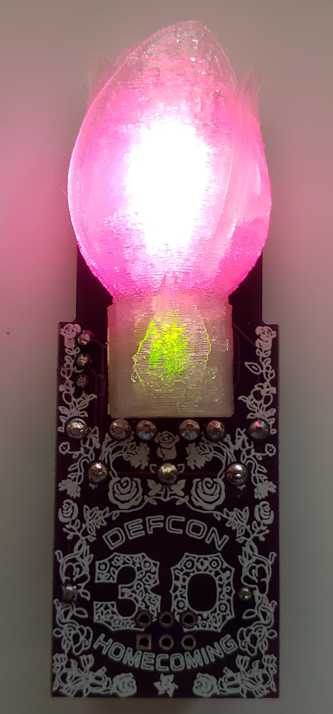
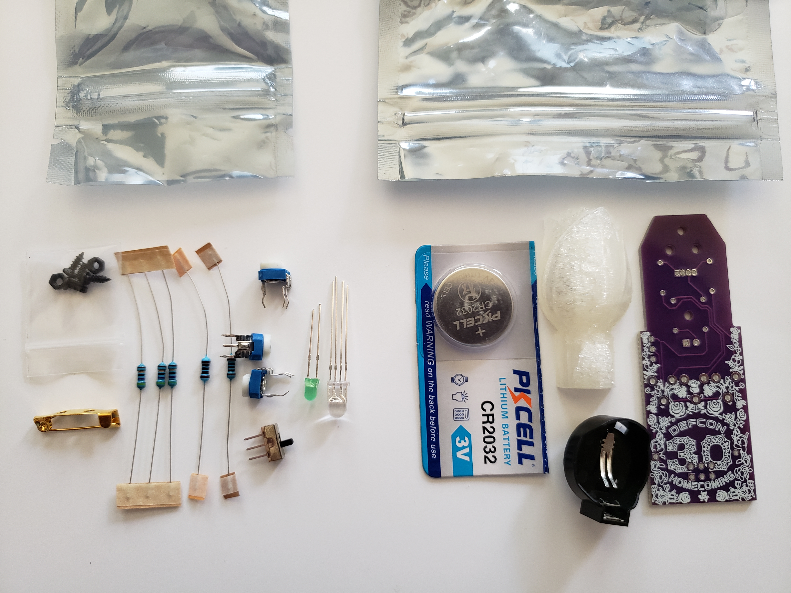
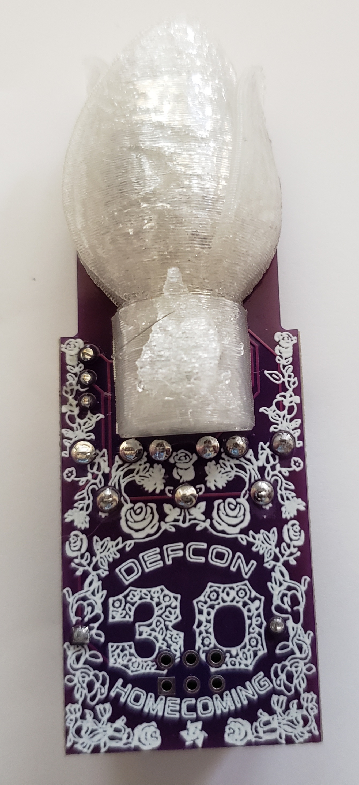
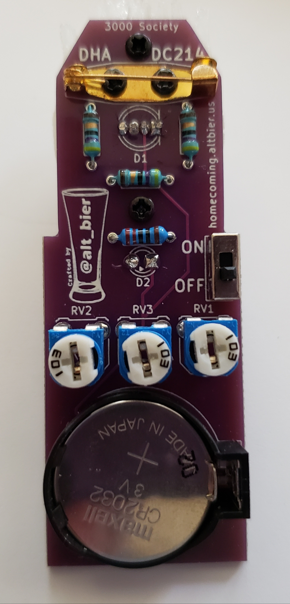

[Home](/) - [Corsage](corsage-assembly.md) - [Boutonniere](Boutonniere-assembly.md)

# Boutonniere Assembly Instructions

Here are the assembly instructions I put together for the Boutonniere hom3c0ming badge add on.

## Component List

This is the list of components that you should have available for the assembly.

*  Boutonniere Kit Bag
  *  1x PCB
  *  1x CR2032 Battery Holder
  *  1x CR2032 Battery
  *  1x 3D Printed Flower LED Diffusers
  *  Boutonniere Small Component Bag Containing:
    *  1x SS12D00 3-Pin SPDT Switch
    *  1x 100 Ohm Resistor
    *  1x 220 Ohm Resistor
    *  3x 47 Ohm Resistors
    *  3x 0-10K Ohm 3-Pin Variable Resistors
    *  1x RGB Common Cathode 5mm 4-Pin LED
    *  1x Green 3mm 2-Pin LED
    *  1x Broach Clip 20mm
    *  Small Screw Hardware Bag Containing:
      *  2x M2x6 Phillips Pan Head Self Tapping Screws
      *  2x M2x5 Phillips Pan Head Screws
      *  2x M2 Hex Nuts

## Soldering Steps

These are the assembly steps that require soldering.
I have presented them in the order I recommend they be implemented for best results.

Before soldering you will need to make a choice between the 100 ohm and 220 ohm resistors for use with the 3mm green LED.  The lower resistance will make the green LED slightly brighter.  I personally prefer the look with the 220 ohm resistor.

*  Solder the 3x 47 Ohm Resistors to the back side of the PCB using the THT holes labeled R1, R2, R3.
  *  This component should be placed with its body on the back side of the PCB and its pins sticking through to the front side of the PCB.
  *  Bending the component pins to an angle after insertion into the PCB will keep it in place when flipping over the PCB to solder.
  *  The component pins should be soldered on the front side of the PCB.
  *  The component pins should be cut as flush to the PCB as the solder joint allows (don't cut the solder joint!).

*  Solder either the 100 ohm OR the 220 ohm Resistor to the back side of the PCB using the THT holes labeled R4.
  *  This component should be placed with its body on the back side of the PCB and its pins sticking through to the front side of the PCB.
  *  Bending the component pins to an angle after insertion into the PCB will keep it in place when flipping over the PCB to solder.
  *  The component pins should be soldered on the front side of the PCB.
  *  The component pins should be cut as flush to the PCB as the solder joint allows (don't cut the solder joint!).

*  Solder the 1x RGB Common Cathode 5mm 4-Pin LED to the front side of the PCB using the THT holes labeled D1.
  *  This component should be placed with its body on the front side of the PCB and its pins sticking through to the back side of the PCB.
  *  Take care to ensure that the component is inserted with the correct alignment by comparing the flat side of the LED body to the indicator lines on the PCB.
  *  This component should be fully inserted in the PCB as far as it can go (i.e., past the stop notches on the pins)
  *  Take care to ensure the component body stays flush to the PCB at 90 degrees when soldering (which should not be much of an issue if inserted fully)
  *  The component pins should be soldered on the back side of the PCB.
  *  The component pins should be cut as flush to the PCB as the solder joint allows (don't cut the solder joint!).

*  Solder the 1x Green 3mm 2-Pin LED to the front side of the PCB using the THT holes labeled D2.
  *  This component should be placed with its body on the front side of the PCB and its pins sticking through to the back side of the PCB.
  *  Take care to ensure that the component is inserted with the correct alignment by comparing the flat side of the LED body to the indicator lines on the PCB.
  *  This component should be fully inserted in the PCB as far as it can go (i.e., past the stop notches on the pins)
  *  Take care to ensure the component body stays flush to the PCB at 90 degrees when soldering (which should not be much of an issue if inserted fully)
  *  The component pins should be soldered on the back side of the PCB.
  *  The component pins should be cut as flush to the PCB as the solder joint allows (don't cut the solder joint!).

*  Solder the 3-Pin Switch to the back side of the PCB using the THT holes labeled ON / OFF.
  *  This component should be placed with its body on the back side of the PCB and its pins sticking through to the front side of the PCB.
  *  Take care to ensure the component body stays flush to the PCB at 90 degrees when soldering
  *  The component pins should be soldered on the front side of the PCB.
  *  The component pins should be cut as flush to the PCB as the solder joint allows (don't cut the solder joint!).  

*  Solder the 3x 0-10K Ohm 3-Pin Variable Resistors to the back side of the PCB using the THT holes labeled RV1, RV2, RV3.
  *  This component should be placed with its body on the back side of the PCB and its pins sticking through to the front side of the PCB.
  *  Take care to ensure that the component is inserted with the correct alignment by using the indicator lines on the PCB.
  *  The component pins should be soldered on the front side of the PCB.
  *  The component pins should be cut as flush to the PCB as the solder joint allows (don't cut the solder joint!).
  *  Pro Tip: Inserting all of these components and then soldering them all allows for faster assembly time

*  Solder the CR2032 Battery Holder to the back side of the PCB in the area indicated on the PCB
  *  This component should be placed with its body on the back side of the PCB and its pins sticking through to the front side of the PCB.
  *  Take care to ensure that the component is inserted with the correct alignment by using the indicator lines on the PCB.
  *  The component pins should be soldered on the front side of the PCB.
  *  The component pins should be cut as flush to the PCB as the solder joint allows (don't cut the solder joint!).
  * Note: If you plan on soldering an SAO connector (not provided in the kit) to this badge then you must NOT solder this battery connector on as this is an either or choice.

## Additional Assembly Steps

These are the additional assembly steps that do not require soldering.
I have presented them in the order I recommend they be implemented for best results.

*  Attach the Broach Clip to the back of the PCB using the M2 fasteners
  *  Unclip the Broach Clip pin and move the pin out of the way exposing the attachment holes.
  *  Hold the Broach Clip against the back of the PCB in its designated location as marked on the PCB making sure the attachment holes line up with the drill holes on the PCB.
  *  Insert an M2x2 Phillips Pan Head Screw through one of the Broach Clip attachment holes into the back of the PCB
  *  Hold the M2 screw in place using a small Phillips head screwdriver
  *  While holding the screw and Broach Clip in place attach an M2 Hex Nut to the end of the screw on the front of the PCB and use fingers to rotate the nut until it is close to the PCB but still loose
  *  Insert an M2x2 Phillips Pan Head Screw through the other Broach Clip attachment hole into the back of the PCB
  *  Hold the M2 screw in place using a small Phillips head screwdriver
  *  While holding the screw and Broach Clip in place attach an M2 Hex Nut to the end of the screw on the front of the PCB and use fingers to rotate the nut until it is close to the PCB but still loose
  *  While holding the hex nuts in place with a tool or fingers, tighten each of these fasteners with a small Phillips head screwdriver
  *  Close the pin on the Broach Clip

*  Attach the 3D Printed Flower LED Diffuser to the front of the PCB using the M2 fasteners
  *  Insert an M2x6 Phillips Pan Head Self Tapping Screw into the back of the PCB into the bottom of the two PCB holes for a flower
  *  Hold the M2 screw in place using a small Phillips head screwdriver
  *  Align the flower middle screw hole over the M2 screw tip sticking through the PCB
  *  While holding the flower in place in the correct alignment (flower top towards PCB edge) use a small Phillips head screwdriver to tighten this fastener just enough that it has a solid grip on the flower but the flower can still move around - DO NOT FULLY TIGHTEN YET
  *  Insert an M2x6 Phillips Pan Head Self Tapping Screw into the back of the PCB into the top (PCB edge) of the two PCB holes for a flower
  *  Hold the M2 screw in place using a small Phillips head screwdriver
  *  Align the flower top screw hole over the M2 screw tip sticking through the PCB
  *  While holding the flower in place in the correct alignment use a small Phillips head screwdriver to fully tighten this fastener in place
  *  Use a small Phillips head screwdriver to fully tighten the bottom screw in place which was left loose in the previous step

## Battery, Pin, and Wear FTW

*  Insert the CR2032 battery into the battery holder with the Positive (+) side up and visible.
  *  Take care to insert using proper polarity or the badge will not power on.

*  Attach the badge to clothing or items by pinning in place using the Broach Clip.

*  With the battery inserted and the badge attached, the ON/OFF switch will control your #Badgelife awesomeness factor

-- [@alt_bier](https://twitter.com/alt_bier)  - [My Contact Info](https://gowen.net/about)
