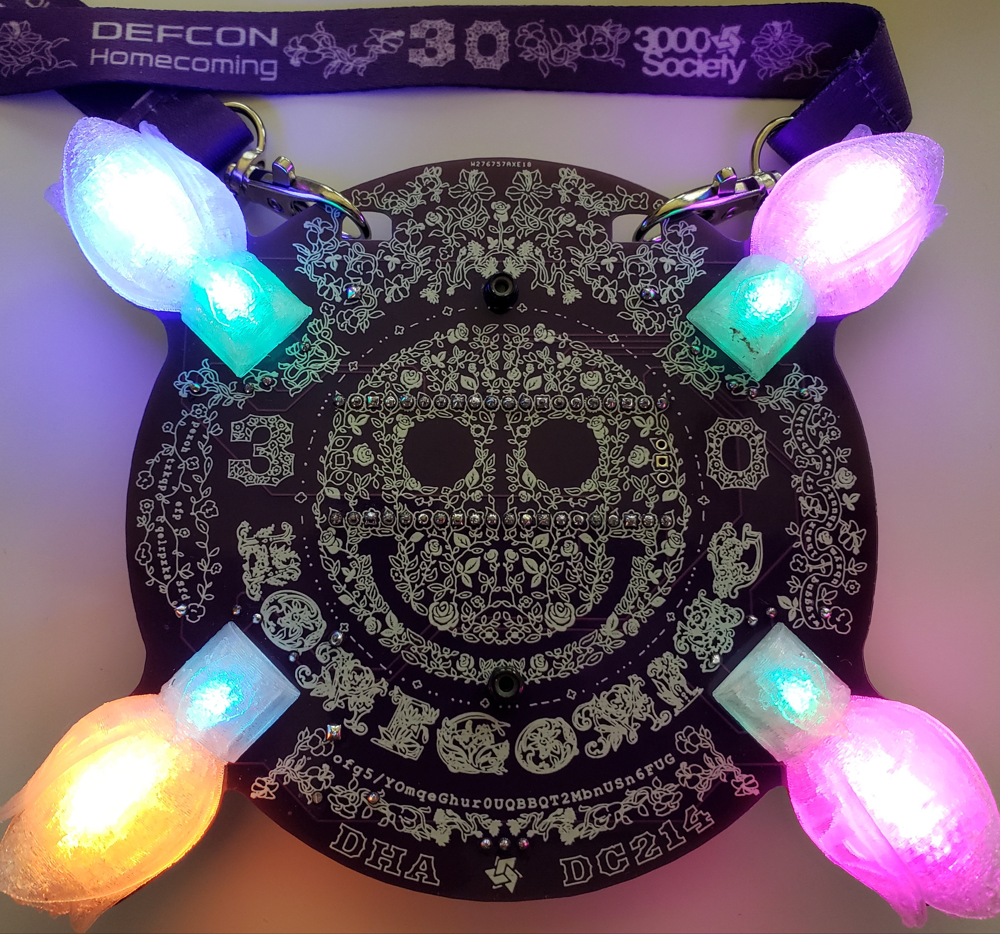
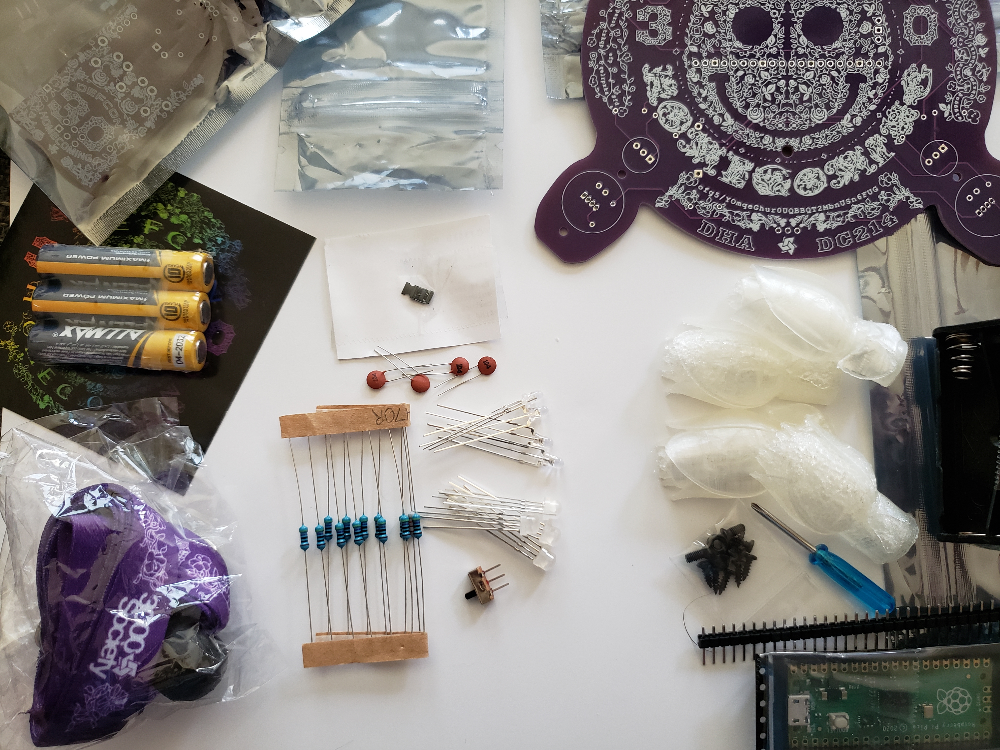
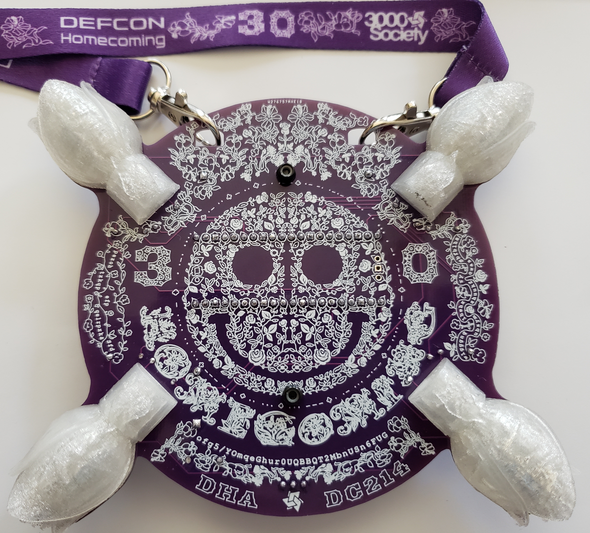
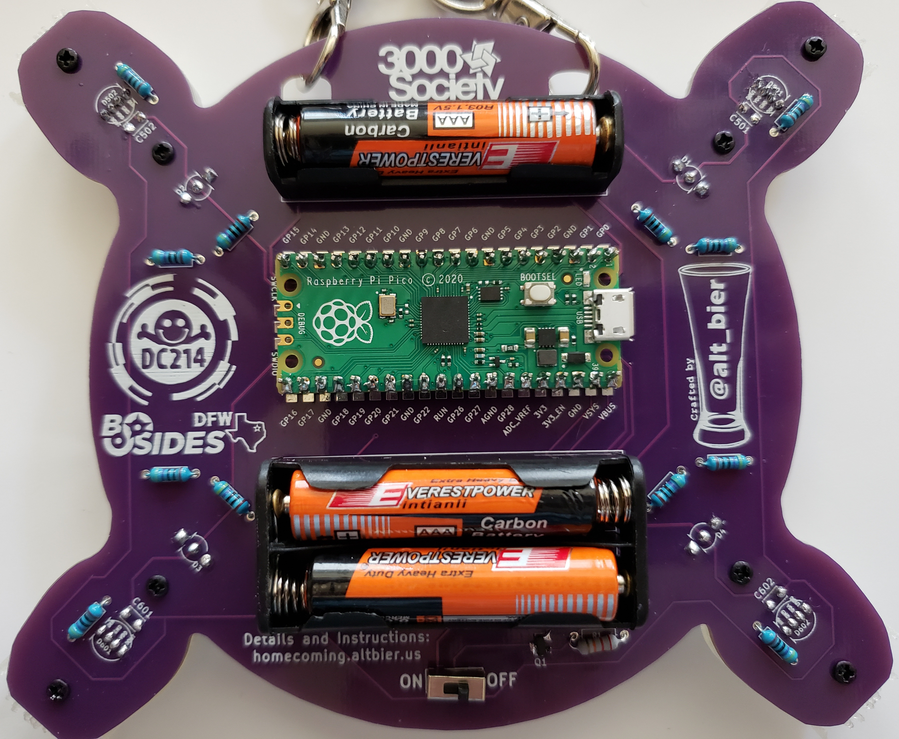

[Home](/) - [Corsage](corsage-assembly.md) - [Boutonniere](Boutonniere-assembly.md)

# Corsage Assembly Instructions

Here are the assembly instructions I put together for the Corsage hom3c0ming badge.

## Component List

This is the list of components that you should have available for the assembly.

*  Main Kit Bag Containing:
  *  1x Sticker (Not Required for Corsage Assembly)
  *  1x PCB
  *  1x Lanyand
  *  3x AAA Batteries
  *  Boutonniere Kit Bag (Not Required for Corsage Assembly)
  *  Corsage Large Component Bag Containing:
    *  1x Raspberry Pi Pico
    *  1x Header Pin Breakaway Strip with 1x40 Pins  
    *  1x Single AAA Battery Holder with THT Pins
    *  1x Dual AAA Battery Holder with THT Pins
    *  4x 3D Printed Flower LED Diffusers
    *  1x Mini Phillips Head Screwdriver
    *  Small Screw Hardware Bag Containing:
      *  8x M2x6 Phillips Pan Head Self Tapping Screws
      *  2x M2.5x6 Phillips Flat Head Screws
      *  2x M2.5 Nylock Hex Locking Nuts
  *  Corsage Small Component Bag Containing:
    *  1x CJ3415 SMT PNP MOSFET Transistor
    *  1x SS12D00 3-Pin SPDT Switch
    *  1x 22K Ohm Resistor
    *  12x 470 Ohm Resistors
    *  4x 100nF Ceramic Disc Capacitors
    *  4x WS2812D RPIN 5mm 4-Pin Addressable LEDs
    *  4x Two Color (BG) 3mm 3-Pin LEDs

## Soldering Steps

These are the assembly steps that require soldering.
I have presented them in the order I recommend they be implemented for best results.

### Power Protection Circuit

*  Solder the SMT MOSFET Transistor to the back side of the PCB on the pads labeled Q1.
  *  This is a surface mount component that can be hand soldered to the PCB
  *  The PCB pads for this component are extra wide to assist in hand soldering
  *  Solder the component to the back side of the PCB.
    *  The component will need to be held in place until the first pin is soldered (use a tool not a thumbnail!)

*  Solder the 22K Ohm Resistor to the back side of the PCB using the THT holes labeled R1.
  *  This component should be placed with its body on the back side of the PCB and its pins sticking through to the front side of the PCB.
  *  Bending the component pins to an angle after insertion into the PCB will keep it in place when flipping over the PCB to solder.
  *  The component pins should be soldered on the front side of the PCB.
  *  The component pins should be cut as flush to the PCB as the solder joint allows (don't cut the solder joint!).

*  Solder the 3-Pin Switch to the back side of the PCB using the THT holes labeled ON / OFF.
  *  This component should be placed with its body on the back side of the PCB and its pins sticking through to the front side of the PCB.
  *  Take care to ensure the component body stays flush to the PCB at 90 degrees when soldering
  *  The component pins should be soldered on the front side of the PCB.
  *  The component pins should be cut as flush to the PCB as the solder joint allows (don't cut the solder joint!).  

### Small Back Side Components: Resistors

*  Solder the 12x 470 Ohm Resistors to the back side of the PCB using the THT holes labeled R2, R4, R6, R8, R10, R12, R14, R16, R181, R182, R201, R202.
  *  This component should be placed with its body on the back side of the PCB and its pins sticking through to the front side of the PCB.
  *  Bending the component pins to an angle after insertion into the PCB will keep it in place when flipping over the PCB to solder.
  *  The component pins should be soldered on the front side of the PCB.
  *  The component pins should be cut as flush to the PCB as the solder joint allows (don't cut the solder joint!).
  *  Pro Tip: Inserting all of these components and then soldering them all allows for faster assembly time

### Small Front Side Components: LEDs and Capacitors

*  Solder the 4x Two Color 3mm 3-Pin LEDs to the front side of the PCB using the THT holes labeled D1, D2, D3, D4.
  *  This component should be placed with its body on the front side of the PCB and its pins sticking through to the back side of the PCB.
  *  Take care to ensure that the component is inserted with the correct alignment by comparing the flat side of the LED body to the indicator lines on the PCB.
  *  This component should be fully inserted in the PCB as far as it can go (i.e., past the stop notches on the pins)
  *  Take care to ensure the component body stays flush to the PCB at 90 degrees when soldering (which should not be much of an issue if inserted fully)
  *  The component pins should be soldered on the back side of the PCB.
  *  The component pins should be cut as flush to the PCB as the solder joint allows (don't cut the solder joint!).
  *  Pro Tip: Inserting all of these components and then soldering them all allows for faster assembly time and keeps the PCB level while soldering.

*  Solder the 4x 100nF Ceramic Disc Capacitors to the front side of the PCB using the THT holes labeled C501, C502, C601, C602.
  *  This component should be placed with its body on the front side of the PCB and its pins sticking through to the back side of the PCB.
  *  Bending the component pins to an angle after insertion into the PCB will keep it in place when flipping over the PCB to solder.
  *  The component pins should be soldered on the back side of the PCB.
  *  The component pins should be cut as flush to the PCB as the solder joint allows (don't cut the solder joint!).
  *  Pro Tip: Inserting all of these components and then soldering them all allows for faster assembly time

*  Solder the 4x WS2812D 5mm 4-Pin LEDs to the front side of the PCB using the THT holes labeled D501, D502, D601, D602.
  *  This component should be placed with its body on the front side of the PCB and its pins sticking through to the back side of the PCB.
  *  Take care to ensure that the component is inserted with the correct alignment by comparing the flat side of the LED body to the indicator lines on the PCB.
  *  This component should be fully inserted in the PCB as far as it can go (i.e., past the stop notches on the pins)
  *  Take care to ensure the component body stays flush to the PCB at 90 degrees when soldering (which should not be much of an issue if inserted fully)
  *  The component pins should be soldered on the back side of the PCB.
  *  The component pins should be cut as flush to the PCB as the solder joint allows (don't cut the solder joint!).
  *  Pro Tip: Inserting all of these components and then soldering them all allows for faster assembly time and keeps the PCB level while soldering.

### Raspberry Pi Pico

*  Solder the header pins onto the Raspberry Pi Pico board
  *  Break the 1x40 Pin Header Pin Breakaway Strip into two 1x20 strips
  *  Insert the 1x20 header pin strips into the THT holes on each side of the Pico board
    *  The header pins should be inserted opposite of normal, inserting the long pin side poking through the top of the Pico board leaving the short pin side for soldering to the PCB. This has two advantages:
      *  This Avoids the need to cut the header pins on the front of the PCB.
      *  This allows the possibility of connecting external things to the Pico using female jumper wires on the back of the PCB.
  *  Take care to ensure the header pins stay flush to the Pico board at 90 degrees when soldering
    *  This can be easily accomplished by placing on a breadboard
  *  The header pins should be soldered on the top side of the Pico
  *  Optionally the header pins can be cut flush to the top of the Pico board (leave as is if you wish have the option to connect to the Pico pins using jumper wires)

*  Solder the Pico board to the back of the PCB using the THT holes labeled IC1
  *  The Pico should be placed with its body on the back side of the PCB (with the top of the Pico visible) and its header pins sticking through to the front side of the PCB.
  *  Take care to ensure that the Pico is inserted with the correct alignment by comparing the three holes on short side of the Pico with the same holes on the PCB.
  *  The Pico header pins should be soldered on the front side of the PCB.
  *  If the header pins were attached to the Pico with the short legs down then there should be no need to cut the pins flush on the front of the PCB.

### Battery Holders

*  Solder the Dual AAA Battery Holder to the back side of the PCB in the area indicated on the PCB
  *  This component should be placed with its body on the back side of the PCB and its pins sticking through to the front side of the PCB.
  *  The component pins should be soldered on the front side of the PCB.
  *  The component pins should be cut as flush to the PCB as the solder joint allows (don't cut the solder joint!).

*  Solder the Single AAA Battery Holder to the back side of the PCB in the area indicated on the PCB
  *  This component should be placed with its body on the back side of the PCB and its pins sticking through to the front side of the PCB.
  *  Take care to ensure that the component is inserted with the correct alignment by comparing the pin polarity of the component with the polarity markings on the PCB
  *  The component pins should be soldered on the front side of the PCB.
  *  The component pins should be cut as flush to the PCB as the solder joint allows (don't cut the solder joint!).

## Additional Assembly Steps

These are the additional assembly steps that do not require soldering.
I have presented them in the order I recommend they be implemented for best results.

### Secure Battery Holders to PCB

*  Attach each Battery Holder Securely to the back of the PCB using the M2.5 fasteners
  *  Insert an M2.5x6 Phillips Flat Head Screw into the back of the PCB through the hole in the middle of the battery holder
  *  Hold the M2.5 screw in place using a small Phillips head screwdriver
  *  Attach the M2.5 Nylock hex nut onto the M2.5 Screw on the front of the PCB
  *  While holding the Nylock nut in place use a small Phillips head screwdriver to tighten this fastener in place
  *  Repeat the above steps for the other battery holder.

### Attach 3D Printed Flowers to PCB

*  Attach each 3D Printed Flower LED Diffuser to the front of the PCB using the M2 fasteners
  *  Insert an M2x6 Phillips Pan Head Self Tapping Screw into the back of the PCB into the bottom of the two PCB holes for a flower
  *  Hold the M2 screw in place using a small Phillips head screwdriver
  *  Align the flower middle screw hole over the M2 screw tip sticking through the PCB
  *  While holding the flower in place in the correct alignment (flower top towards PCB edge) use a small Phillips head screwdriver to tighten this fastener just enough that it has a solid grip on the flower but the flower can still move around - DO NOT FULLY TIGHTEN YET
  *  Insert an M2x6 Phillips Pan Head Self Tapping Screw into the back of the PCB into the top (PCB edge) of the two PCB holes for a flower
  *  Hold the M2 screw in place using a small Phillips head screwdriver
  *  Align the flower top screw hole over the M2 screw tip sticking through the PCB
  *  While holding the flower in place in the correct alignment use a small Phillips head screwdriver to fully tighten this fastener in place
  *  Use a small Phillips head screwdriver to fully tighten the bottom screw in place which was left loose in the previous step
  *  Repeat the above steps for each of the four 3D printed flowers.

## Batteries, Lanyard, and Wear FTW

*  Insert the three AAA batteries into the battery holders.
  *  Take care to insert using proper polarity or the badge will not power on.

*  Attach the Lanyard to the PCB using the two lanyard clips in the two top arched holes in the PCB.
  *  The lanyard has a length adjustment attachment that can be moved as needed using its button

*  With the batteries inserted and the badge around your neck, the ON/OFF switch will control your #Badgelife awesomeness factor
  *  The badge should be turned off when connecting to the Pico using its USB cable (although the power protection circuit should prevent the blue smoke monster)

-- [@alt_bier](https://twitter.com/alt_bier)  - [My Contact Info](https://gowen.net/about)
