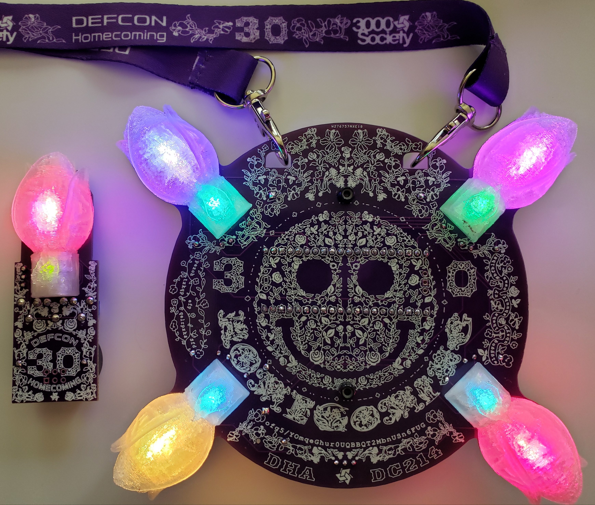

[Home](/) - [Corsage](corsage-assembly.md) - [Boutonniere](boutonniere-assembly.md)

# hom3c0ming badge

Welcome to the hom3c0ming badge website/repository.

This is where you will find all the details and files and instructions related to my DC30 hom3c0ming badge kit.

The idea for this badge came from the DEFCON 30th anniversary theme: "Hacker Homecoming".
Thinking of the high school homecoming dances of my youth I immediately thought of flowers.

This kit is made up of two parts: A Corsage and a Boutonniere.
The corsage is the traditional badge shape/size with a lanyard and the boutonniere is a small pin-on or SAO attached add on.

I wanted to focus more on the art then features.  That being said, using the Raspberry Pi Pico opens up many hackable opportunities for this badge.
There are plenty of badges out there that do all the things.  I wanted this one to have all the looks.  And I think I have achieved that goal.

To focus on the art I spent literally hundreds of hours perfecting what is the most detailed silk layer I have ever attempted before.  I also included a 3D print element in the form of flowers that are LED diffusers which attach to the badge.

Regarding this being a kit that you need to assemble, this was a choice made due to popular demand.  My previous few badges were fully assembled and were big hits, but many people asked for kit versions and expressed their love of the DIY badge kit.  I think that building a badge from a kit gets a person invested in that badge and raises their appreciation for it.  So, the decision was made to make this a kit.

I hope that everyone who gets one of these badge kits enjoys it.  It was made with love for everyone in the community to enjoy.  And as with all my badges, it is all open hardware/software with all files provided in this repository.  So, if you didn't have a chance to get one of these kits at the con you can always make your own.

-- [@alt_bier](https://twitter.com/alt_bier)  - [My Contact Info](https://gowen.net/about)

---

# Details

Assembly Instructions for the Corsage can be found here: [Corsage](corsage-assembly.md)

Assembly Instructions for the Boutonniere can be found here: [Boutonniere](boutonniere-assembly.md)

More badge details to be added soon.
